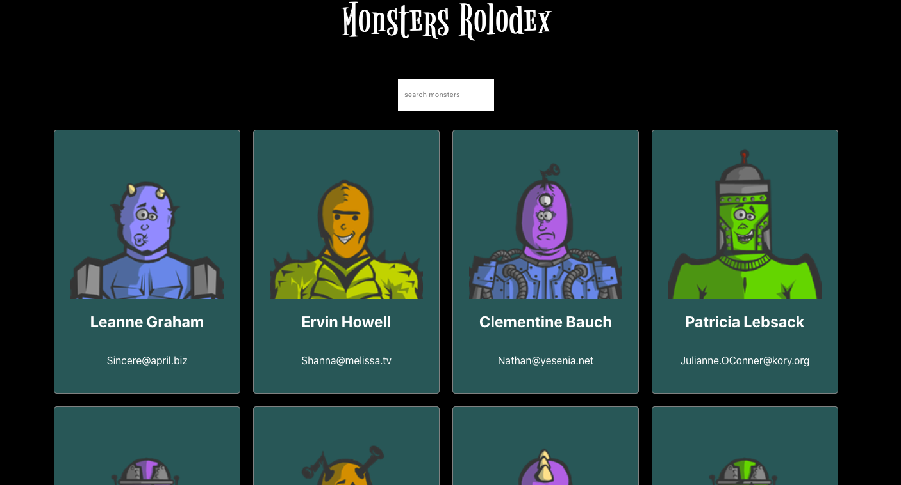

# Monster rolodex

> A basic monster search made with [React](https://reactjs.org/).

    

This project consisted on building a monster search using [create-react-app](https://create-react-app.dev/). This project was built for learning porpuses to understand the fundamentals of [React](https://reactjs.org/) library.

## Built With

- [create-react-app](https://create-react-app.dev/)

## Live Demo

[https://fivan18.github.io/monster-rolodex/](https://fivan18.github.io/monster-rolodex/)

## Getting Started

To get a local copy up and running follow these simple example steps.

### Prerequisites

Make sure you have installed [Node JS](https://nodejs.org/en/). If not, follow this [guide](https://www.geeksforgeeks.org/installation-of-node-js-on-linux/) for Linux or this [one](https://treehouse.github.io/installation-guides/mac/node-mac.html) for Mac OS.

### Setup

Download the project

    $ git clone https://github.com/fivan18/monster-rolodex.git

Install the dependencies

    $ npm install

### Install

To modify the code and see the changes on live go to the project's root directory and run:

    $ npm start

### Usage

Open the next link [http://localhost:3000/](http://localhost:3000/).

### Run tests

This project doesn't count with test.

### Deployment

This project was deployed with [GitHub Pages](https://pages.github.com/). Follow [this](https://create-react-app.dev/docs/deployment#github-pages) instructions to deploy the app.

## Authors

👤 **Ivan Ulises Guzman Sanchez**

- Github: [@fivan18](https://github.com/fivan18)
- Twitter: [@fivanunam](https://twitter.com/fivanunam)
- Linkedin: [fivan](https://www.linkedin.com/in/fivan)

## Contributing

Contributions, issues and feature requests are welcome!

Feel free to check the [issues page](https://github.com/fivan18/monster-rolodex/issues).

## Show your support

Give a ⭐️ if you like this project!
